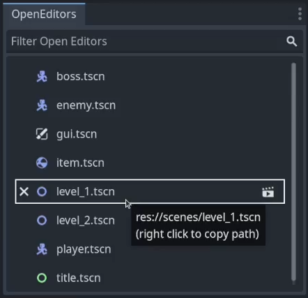

# Godot Open Editors
This add on introduces a new dock for the Godot Editor that lists the current open editors for your project.  With this list you can more easily find an open scene when you have many scenes open.  You can also close and play scenes from the list without having to find the scene's editor tab as well as quickly copy the scene path with a click of the right mouse button.

## Install

To install this add-on, look for it in the Godot asset library. Or you can download this repository and copy the addons/open_editors folder to your project.

##  Support This and Other Free Tools
If you would like to support my development work to maintain this and other such projects you can do so at https://www.buymeacoffee.com/jlothamer.

